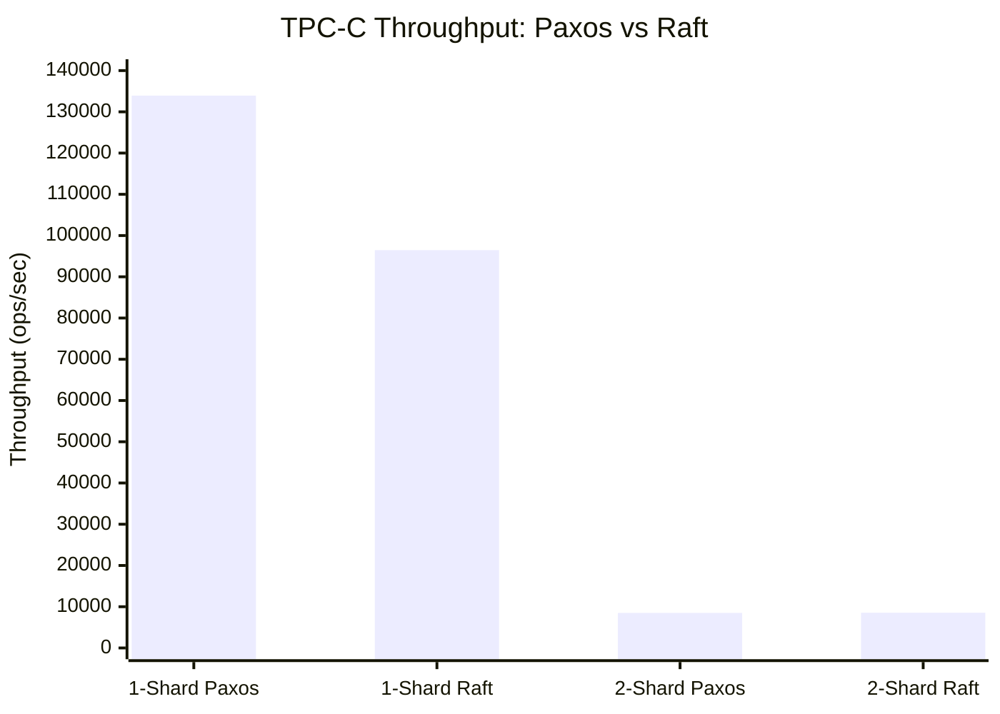
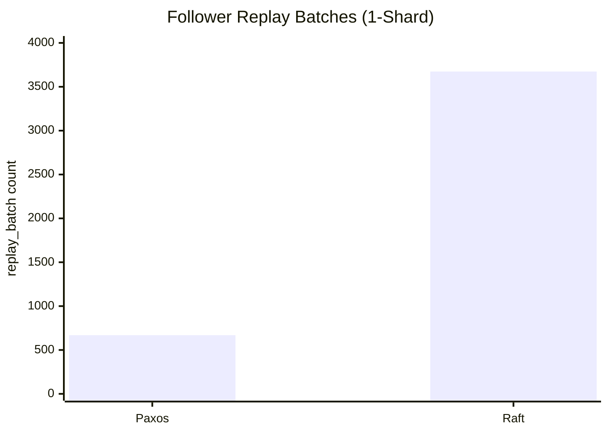

# Performance Figures and Charts

## 1. 1-Shard TPC-C Throughput Comparison

```
  agg_persist_throughput (ops/sec)

  140,000 |  #######
  130,000 |  #######
  120,000 |  #######
  110,000 |  #######
  100,000 |  #######  #######
   90,000 |  #######  #######
   80,000 |  #######  #######
   70,000 |  #######  #######
   60,000 |  #######  #######
   50,000 |  #######  #######
   40,000 |  #######  #######
   30,000 |  #######  #######
   20,000 |  #######  #######
   10,000 |  #######  #######
        0 +--Paxos----Raft---

  Paxos: 133,931 ops/sec
  Raft:   96,463 ops/sec  (28.0% lower)
```

## 2. 2-Shard TPC-C Per-Shard Throughput

```
  agg_persist_throughput (ops/sec per shard)

   9,000 |  #######  #######  #######  #######
   8,000 |  #######  #######  #######  #######
   7,000 |  #######  #######  #######  #######
   6,000 |  #######  #######  #######  #######
   5,000 |  #######  #######  #######  #######
   4,000 |  #######  #######  #######  #######
   3,000 |  #######  #######  #######  #######
   2,000 |  #######  #######  #######  #######
   1,000 |  #######  #######  #######  #######
       0 +--Pax-S0--Pax-S1--Raft-S0--Raft-S1-

  Paxos Shard 0: 8,464 ops/sec
  Paxos Shard 1: 8,539 ops/sec
  Raft  Shard 0: 8,491 ops/sec   (Paxos data from raft run)
  Raft  Shard 1: 8,580 ops/sec

  All four values within 1.4% of each other — effectively equal.
```

## 3. Throughput Scaling: 1-Shard to 2-Shard

```
  ops/sec (log scale, per shard)

  133,931 |  *  Paxos
          |    \
          |      \     * 96,463  Raft
          |        \  /
          |          \/
   10,000 |          /\
          |        /    \
    8,501 |  ----*--------*---- 8,536
          |  Paxos 2S    Raft 2S
          +--------+--------+
           1-shard    2-shard

  Paxos: 133,931 --> 8,501/shard  (15.8x drop)
  Raft:   96,463 --> 8,536/shard  (11.3x drop)

  Both converge to ~8,500 ops/sec when cross-shard
  coordination (~10ms latency) becomes the bottleneck.
```

## 4. Per-Transaction Commit Latency (1-Shard)

```
  Commit latency (ms)

  0.14 |                 ##
       |                 ##
  0.12 |                 ##      ##
       |                 ##      ##
  0.10 |                 ##      ##            ##  ##
       |                 ##      ##            ##  ##
  0.08 |           ##    ##      ##            ##  ##
       |           ##    ##      ##            ##  ##
  0.06 |           ##    ##      ##            ##  ##
       |  ##       ##    ##      ##            ##  ##
  0.04 |  ##  ##   ##    ##      ##            ##  ##
       |  ##  ##   ##    ##      ##            ##  ##
  0.02 |  ##  ##   ##    ##      ##   ##  ##   ##  ##
       |  ##  ##   ##    ##      ##   ##  ##   ##  ##
     0 +--P---R----P-----R-------P----R---P----R---R-
          NewOrder  Payment   Delivery  OrdSt  Stock

  P = Paxos, R = Raft

  NewOrder:    Paxos 0.045 ms | Raft 0.039 ms  (Raft 13% faster)
  Payment:     Paxos 0.033 ms | Raft 0.082 ms  (Paxos 60% faster)
  Delivery:    Paxos 0.138 ms | Raft 0.116 ms  (Raft 16% faster)
  OrderStatus: Paxos 0.014 ms | Raft 0.011 ms  (Raft 19% faster)
  StockLevel:  Paxos 0.103 ms | Raft 0.109 ms  (Paxos 6% faster)
```

## 5. Follower Replay Batch Comparison (1-Shard)

```
  replay_batch count

  4,000 |            #######
  3,500 |            #######
  3,000 |            #######
  2,500 |            #######
  2,000 |            #######
  1,500 |            #######
  1,000 |            #######
    500 |  #######   #######
      0 +--Paxos-----Raft---

  Paxos:   669 batches (avg ~6,058 entries/batch)
  Raft:  3,674 batches (avg   ~794 entries/batch)

  Raft processes 5.5x more batches with 7.6x smaller batch size.
```

## 6. Architectural Comparison Table

| Aspect | Multi-Paxos | Raft |
|--------|-------------|------|
| **Topology** | | |
| Voters per shard | 3 | 3 |
| Learner per shard | 1 | 0 |
| Total processes (1-shard) | 4 | 3 |
| Total processes (2-shard) | 8 | 6 |
| Quorum size | 2 of 3 | 2 of 3 |
| Fault tolerance | 1 failure | 1 failure |
| **Protocol** | | |
| Log ordering | Per-instance | Sequential |
| Pipelining | Yes (out-of-order) | No (in-order) |
| Leader election | External | Built-in (RequestVote) |
| Preferred leader | N/A | TimeoutNow transfer |
| **Performance (1-shard)** | | |
| Throughput | 133,931 ops/sec | 96,463 ops/sec |
| Follower replay batches | 669 | 3,674 |
| Avg entries per batch | ~6,058 | ~794 |
| Total commits | 4,052,553 | 2,915,817 |
| **Performance (2-shard)** | | |
| Per-shard throughput | ~8,501 ops/sec | ~8,536 ops/sec |
| Remote abort ratio | 1.28% | 2.64% |
| Throughput drop (1 to 2) | 15.8x | 11.3x |
| **Correctness** | | |
| Data integrity | Verified | Verified |
| Follower consistency | All pass | All pass |

## 7. Remote Abort Ratio Comparison (2-Shard)

```
  NewOrder remote abort ratio (%)

  3.0 |                     ##
      |            ##       ##
  2.5 |            ##       ##
      |            ##       ##
  2.0 |            ##       ##
      |            ##       ##
  1.5 |            ##       ##
      |   ##       ##       ##
  1.0 |   ##  ##   ##       ##   ##
      |   ##  ##   ##       ##   ##
  0.5 |   ##  ##   ##       ##   ##
      |   ##  ##   ##       ##   ##
    0 +---S0--S1---S0--S1---S0---S1-
         Paxos      Raft     Raft
        (ci_results) (ci_results) (ci_raft)

  Paxos Shard 0: 0.90%    Raft Shard 0: 1.79-2.65%
  Paxos Shard 1: 1.44%    Raft Shard 1: 1.12-2.71%

  Raft shows ~2x higher remote abort ratio in cross-shard
  transactions, possibly due to sequential commit timing.
```

## 8. Process Count vs Throughput

```
  Throughput per process (ops/sec)

  35,000 |            #######
  30,000 |  #######   #######
         |  #######   #######
  25,000 |  #######   #######
         |  #######   #######
  20,000 |  #######   #######
         |  #######   #######
  15,000 |  #######   #######
         |  #######   #######
  10,000 |  #######   #######
         |  #######   #######
   5,000 |  #######   #######
         |  #######   #######
       0 +--Paxos-----Raft---

  Paxos: 133,931 / 4 processes = 33,483 ops/sec/process
  Raft:   96,463 / 3 processes = 32,154 ops/sec/process

  Per-process throughput is within 4% — Raft is nearly as
  efficient per process as Paxos despite lower absolute throughput.
```

## 9. Mermaid Charts (for Markdown Renderers)

### 9.1 Throughput Comparison



### 9.2 Follower Replay Batches



### 9.3 Per-Transaction Latency

```mermaid
xychart-beta
    title "Per-Transaction Commit Latency (ms)"
    x-axis ["NewOrder", "Payment", "Delivery", "OrderStatus", "StockLevel"]
    y-axis "Latency (ms)" 0 --> 0.15
    bar "Paxos" [0.045, 0.033, 0.138, 0.014, 0.103]
    bar "Raft" [0.039, 0.082, 0.116, 0.011, 0.109]
```


